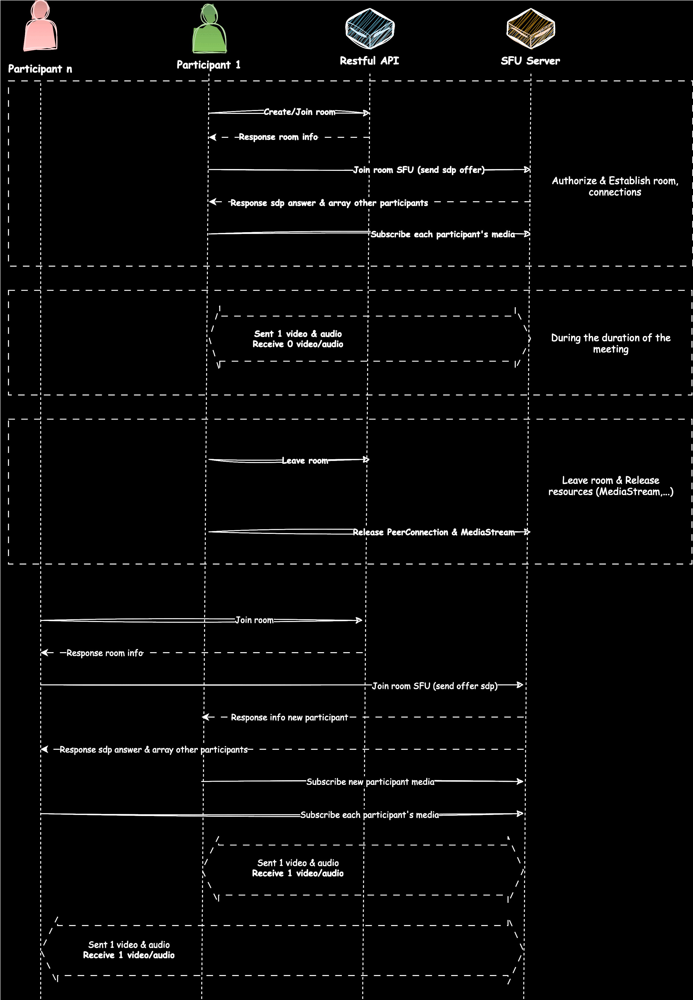
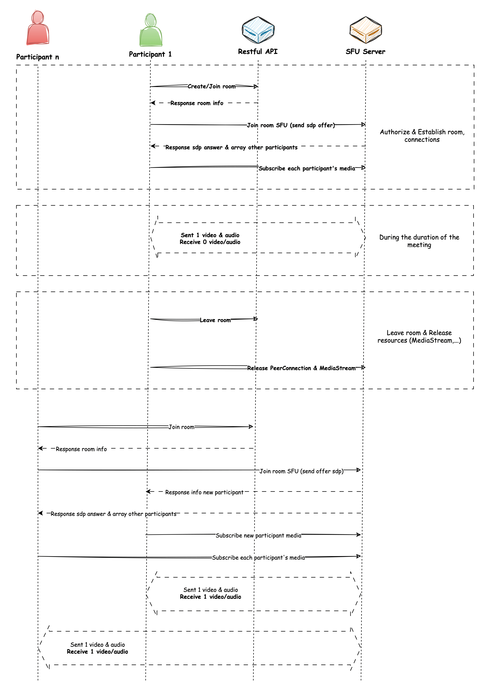
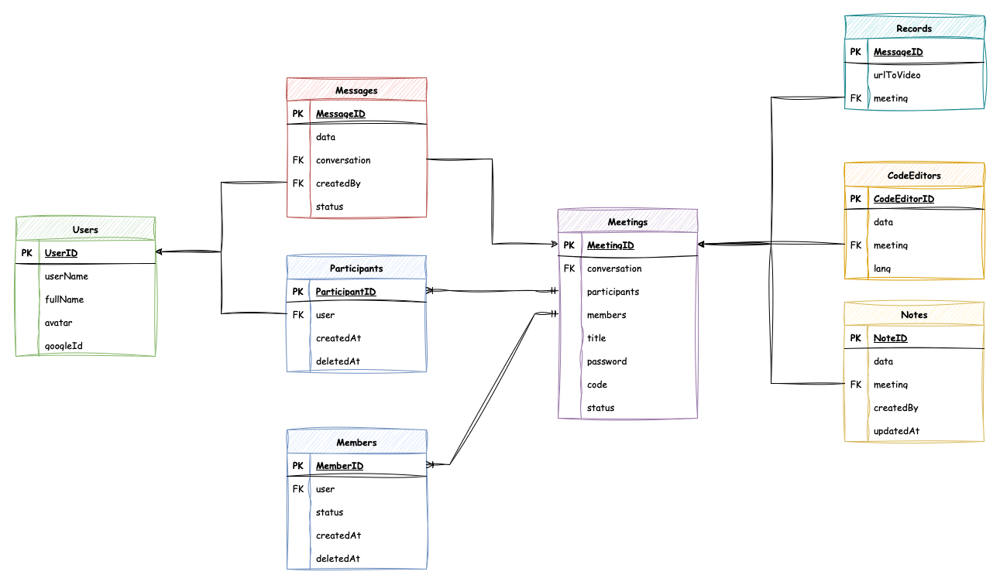

<h2 align="center">Waterbus Server API</h2>
<div class="badges" align="center">
<p><a href="https://codecov.io/gh/waterbustech/waterbus"></a><a href="https://www.codefactor.io/repository/github/waterbustech/waterbus"></a><a href="https://chromium.googlesource.com/external/webrtc/+/branch-heads/6099"></a><a href="https://github.com/lambiengcode"></a></p>
</div>
<div align="center">
<a href="https://twitter.com/waterbustech"></a><a href="https://discord.gg/mfrWVefU"></a>
</div>
<p align="center">
  <a href="https://docs.waterbus.tech">Website</a> &bull;
  <a href="https://github.com/waterbustech/waterbus/wiki">Wiki</a> &bull;
  <a href="https://github.com/waterbustech/waterbus/blob/main/LICENSE">License</a>
</p>

## Table of Contents
- [Table of Contents](#table-of-contents)
- [Introduction](#introduction)
  - [Meeting Flow](#meeting-flow)
  - [Entity Relationship Diagram (ERD)](#entity-relationship-diagram-erd)
  - [Features](#features)
- [Quick run](#quick-run)
  - [Requirements](#requirements)
- [Roadmap](#roadmap)
- [Links:](#links)

## Introduction

- 🤙 Waterbus is open source video conferencing multiplatform app built on latest WebRTC SDK. This is server api for the application. 
- 🎯 Waterbus aims for scalability and low latency as well as self-hosted and offers many useful features for everyday interviews or meetings.

### Meeting Flow

[](https://docs.waterbus.tech#gh-dark-mode-only)
[](https://docs.waterbus.tech#gh-light-mode-only)

### Entity Relationship Diagram (ERD)

[](https://docs.waterbus.tech#gh-dark-mode-only)
[](https://docs.waterbus.tech#gh-light-mode-only)

### Features

- [x] Login with Google
- [x] Refresh Token
- [x] Authenticate gRPC
- [x] Users
  - [x] Get info user
  - [x] Update info user
- [ ] Meetings
  - [x] Create meeting
  - [x] Update meeting
  - [x] Users management
    - [x] Join/Leave meeting
    - [x] Invite user
    - [x] Remove user
    - [x] Accept invitation
  - [ ] Code Editor
    - [ ] Create record
    - [ ] Update record
  - [ ] Notes
    - [ ] Create note
    - [ ] Update note
- [x] Chats
  - [x] Get conversations by user
  - [x] Get messages by conversation
  - [x] Send message
  - [x] Edit message
  - [x] Delete message
  - [x] Delete conversations

## Quick run

### Requirements

Before getting started, ensure you have the following software installed:

- `Node.js`
- `NestJS CLI`
- `Postgres`

- Clone repository

```sh
git clone https://github.com/waterbustech/waterbus-server-api.git
cd waterbus-server-api/
```

- Create .env file

```sh
cp env-example .env
```

- Install dependencies

```sh
yarn
```

- Start server

```sh
yarn start
```

## Roadmap

<div align="center">


</div>

## Links: 

- Check document at [docs.waterbus.tech](https://docs.waterbus.tech)
- Flutter app [repository]()
- Server SFU WebSocket [repository]()

<h4 align="center">Built with 💙 by the Waterbus team.</h4>
