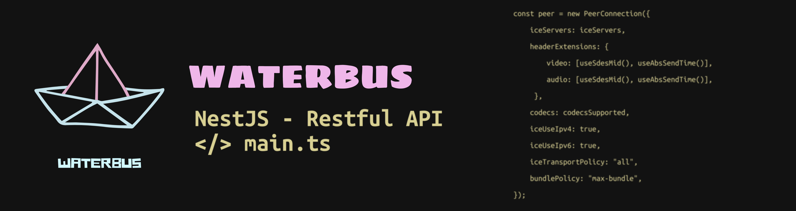
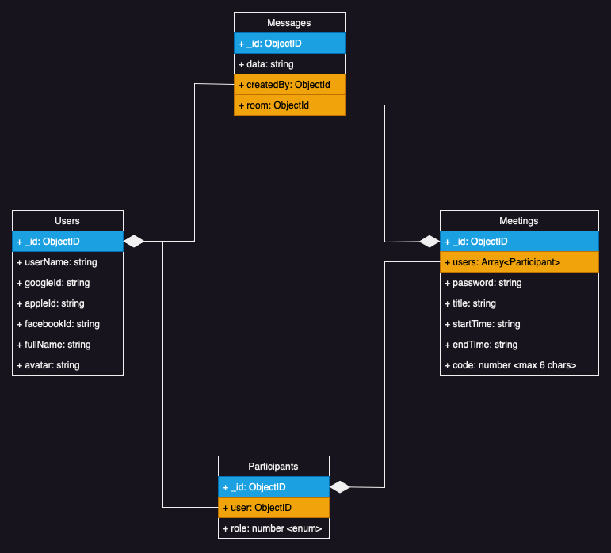

# Auth Service (waterbus.cloud)



## Description

NestJS REST API boilerplate for typical project

[Full documentation here](https://github.com/brocoders/nestjs-boilerplate/blob/main/docs/readme.md)

## Table of Contents
- [Auth Service (waterbus.cloud)](#auth-service-waterbuscloud)
  - [Description](#description)
  - [Table of Contents](#table-of-contents)
  - [Introduce](#introduce)
  - [ERD](#erd)
  - [Communications (gRPC)](#communications-grpc)
  - [Features](#features)
  - [Quick run](#quick-run)
  - [Tests](#tests)
  - [Tests in Docker](#tests-in-docker)
  - [Test benchmarking](#test-benchmarking)

## Introduce

## ERD


## Communications (gRPC)

- Receive user token from other services and response user information if it's correct

## Features

- [x] Login with Social (Google, Facebook, Apple)
- [x] Refresh Token
- [x] Authenticate gRPC
- [x] Users
  - [x] Get info user
  - [x] Update info user

## Quick run

```bash
git clone --depth 1 https://github.com/waterbuscloud/auth-services.cloud.git my-app
cd my-app/
cp env-example .env
docker compose up -d
```

For check status run

```bash
docker compose logs
```

## Tests

```bash
# unit tests
yarn test

# e2e tests
yarn test:e2e
```

## Tests in Docker

```bash
docker compose -f docker-compose.ci.yaml --env-file env-example -p ci up --build --exit-code-from api && docker compose -p ci rm -svf
```

## Test benchmarking

```bash
docker run --rm jordi/ab -n 100 -c 100 -T application/json -H "Authorization: Bearer USER_TOKEN" -v 2 http://<server_ip>:3000/api/v1/users
```